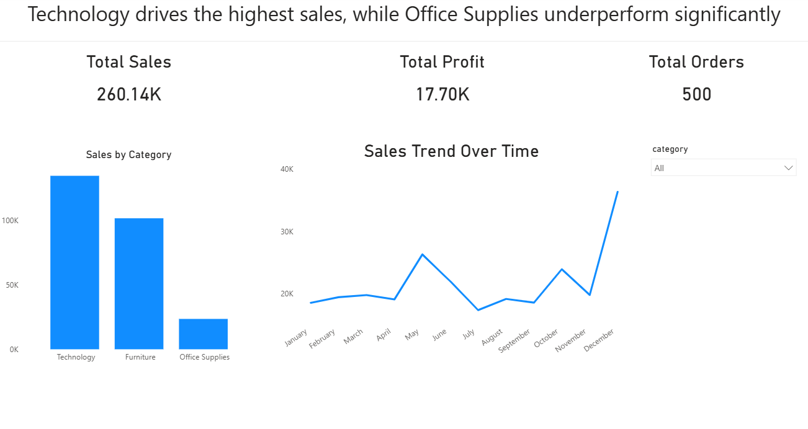
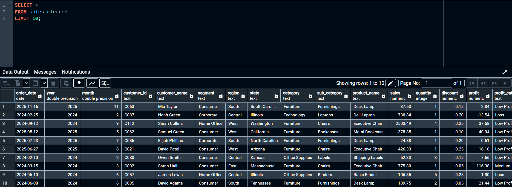
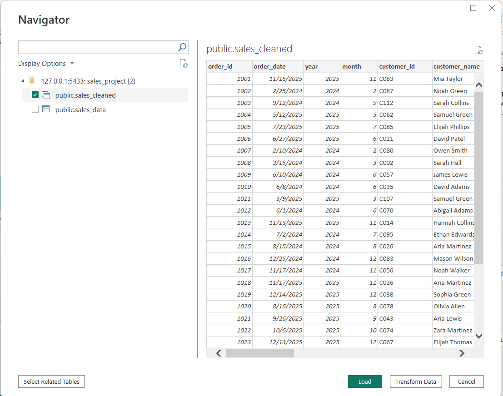

# Sales Analysis Dashboard (PostgreSQL + Power BI)

## 📌 Overview

This project demonstrates an end-to-end analytics workflow, transforming raw sales data using PostgreSQL and building an interactive Power BI dashboard to uncover performance trends, category insights, and business opportunities.

---

## Tools & Technologies

* PostgreSQL (Data cleaning and transformation)
* Power BI (Data visualization and dashboarding)

---

## Dataset

The dataset includes transactional sales data with fields such as:

* Order ID
* Order Date
* Category
* Sales
* Profit

---

## 🧹 Data Preparation (PostgreSQL)

The dataset was transformed using a SQL view (`sales_cleaned`) to prepare it for analysis and visualization.

### Key Transformations:

* Extracted **year** and **month** from the order date for time-based analysis
* Created a **profit_category** field using CASE logic to segment orders into Loss, Low, Medium, and High profit groups
* Structured the dataset for efficient use in Power BI

These transformations enabled easier aggregation, filtering, and business insight generation within the dashboard.

---

## Dashboard Features (Power BI)

### Key Performance Indicators (KPIs)

* Total Sales
* Total Profit
* Total Orders

### Visualizations

* Sales by Category (bar chart)
* Profit by Category (comparison)
* Sales Trend Over Time (monthly line chart)

### Interactivity

* Category slicer to dynamically filter all visuals

---

## 🚀 Key Highlights
- Built an end-to-end analytics workflow from raw data to dashboard
- Applied SQL transformations using `DATE_PART` and `CASE` logic
- Designed KPI-driven dashboard with interactive filtering
- Focused on business insights, not just visualization

---

## 📈 Key Insights
- Technology is the top-performing category by revenue
- Office Supplies underperforms relative to the other product categories
- Sales trend patterns show variability over time, suggesting potential seasonality
---

## 📸 Screenshots
SQL Data Cleaning

Power BI Query Editor

Final Dashboard

---

## ▶️ How to Use
1. Open `powerbi/Sales Dashboard.pbix` in Power BI Desktop
2. Refresh the data source if needed
3. Use the category slicer to explore the dashboard
